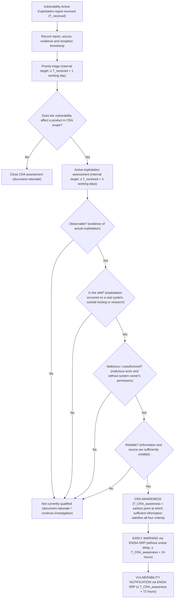

# CRA Active Exploitation Reporting Process

```mermaid
flowchart TD

    A["Vulnerability Active Exploitation report received (T_received)"] --> B["Record report, source, evidence and reception timestamp"]

    B --> C["Priority triage (internal target: ≤ T_received + 1 working day)"]

    C --> D{"Does the vulnerability affect a product in CRA scope?"}

    D -- "No" --> X["Close CRA assessment (document rationale)"]

    D -- "Yes" --> E["Active exploitation assessment (internal target: ≤ T_received + 3 working days)"]

    E --> F{"Observable? (evidence of actual exploitation)"}

    F -- "No" --> Y["Not currently qualified (document rationale / continue investigation)"]
    F -- "Yes" --> G{"In the wild? (exploitation occurred on a real system, outside testing or research)"}

    G -- "No" --> Y
    G -- "Yes" --> H{"Malicious / unauthorized? (malicious actor and without system owner's permission)"}

    H -- "No" --> Y
    H -- "Yes" --> I{"Reliable? (information and source are sufficiently credible)"}

    I -- "No" --> Y
    I -- "Yes" --> L["CRA AWARENESS (T_CRA_awareness = earliest point at which sufficient information satisfies all four criteria)"]

    L --> M["EARLY WARNING via ENISA SRP (without undue delay, ≤ T_CRA_awareness + 24 hours)"]

    M --> N["VULNERABILITY NOTIFICATION via ENISA SRP (≤ T_CRA_awareness + 72 hours)"]
```
