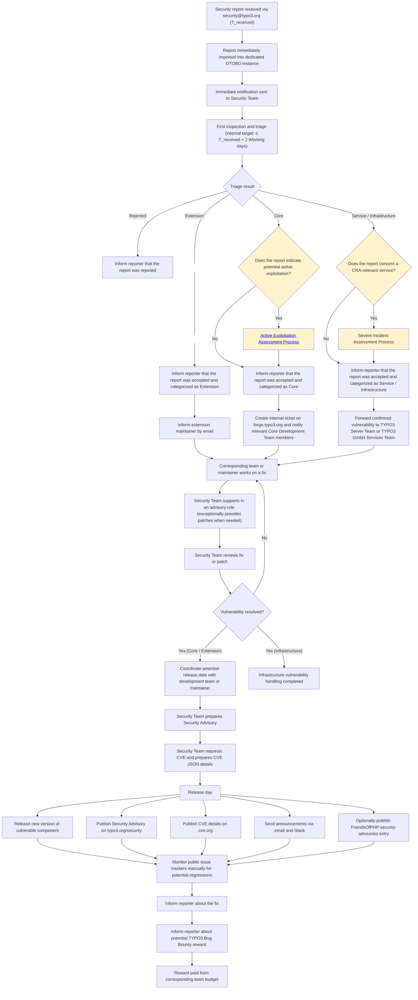

# Security Report handling Process

## Definitions

**Working days**: Monday to Friday, during normal working hours, excluding weekends and applicable public holidays. Time outside working hours does not count toward the deadline.

**Internal target**: A best-effort processing target for the Security Team, taking into account the voluntary nature of open-source contributions. It is an internal objective, not a mandatory deadline.

## Flowchart

