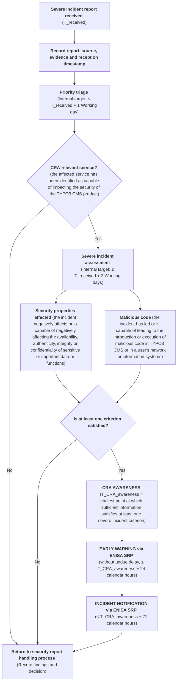

# CRA Severe Incident Reporting Process

## Definitions

**Working days**: Monday to Friday, during normal working hours, excluding weekends and applicable public holidays. Time outside working hours does not count toward the deadline.

**Calendar hours**: All consecutive hours, 24 hours a day and 7 days a week, including nights, weekends, and public holidays. Time continues to count without interruption.

**Internal target**: A best-effort processing target for the Security Team, taking into account the voluntary nature of open-source contributions. It is an internal objective, not a mandatory deadline.

**Regulatory deadline**: A mandatory time limit established by the CRA for the open-source Stewards.

## Flowchart

